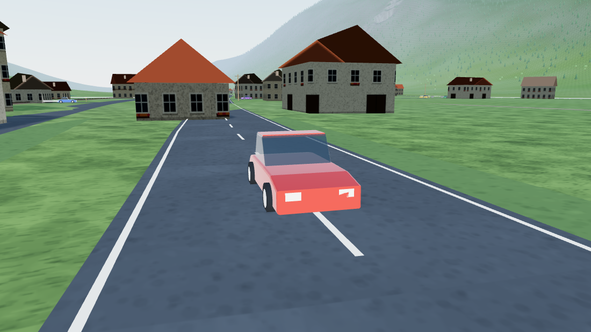

# Frojach Drive

Ein Fahrspiel im GTA-Stil durch **Frojach** im oberen Murtal (Gemeinde
Teufenbach-Katsch, Bezirk Murau, Steiermark).

Kein Rennkurs, sondern der Ort selbst: die B 96 Murtalstraße durch die
Ortsdurchfahrt, die Abzweigung ins Katschtal, die Murbrücke ans andere Ufer,
die Murtalbahn quer durchs Tal, dahinter die Hänge zum Puxberg. Einsteigen,
losfahren, hinschauen.



---

## Losfahren

```bash
npm install
npm run dev          # http://localhost:5173
```

Für eine gebaute Fassung:

```bash
npm run build
npm run preview
```

Der Build ist vollständig statisch (`dist/`) und läuft aus jedem Unterordner —
GitHub Pages, ein einfacher Webserver oder ein entpacktes ZIP genügen.

---

## Steuerung

| Taste | Wirkung | Taste | Wirkung |
| --- | --- | --- | --- |
| `W` / `↑` | Gas | `S` / `↓` | Bremse, dann Rückwärtsgang |
| `A` `D` / `←` `→` | Lenken | `Leertaste` | Handbremse (Drift) |
| `C` | Kamera wechseln | `V` | **Street-View-Modus** |
| `M` | Große Karte | `H` | Hupe |
| `L` | Licht | `R` | Auto auf die Straße zurücksetzen |
| `F` | Fahrzeug wechseln | `J` | Auftrag starten / abbrechen |
| `T` | Uhrzeit vorstellen | `P` / `Esc` | Pause |

Gamepad wird erkannt (RT Gas, LT Bremse, linker Stick lenkt). Auf Touchgeräten
blenden sich Pedale und Lenkung automatisch ein.

Vier Fahrzeuge: Kleinwagen, Kombi, Sportwagen und ein Traktor, der genau so
langsam ist, wie er sein soll.

---

## Woher die Welt kommt

Das Spiel erfindet Frojach nicht, es baut es aus Daten.

### Straßen, Gebäude, Mur, Murtalbahn — OpenStreetMap

Beim ersten Start holt das Spiel den Kartenausschnitt live von der
**Overpass-API**: Straßennetz mit Klassifizierung und Tempolimits,
Gebäudegrundrisse samt Geschosszahl, Fluss- und Bachläufe, die Schmalspur der
Murtalbahn, Wald- und Wiesenflächen. Das Ergebnis liegt danach 30 Tage im
IndexedDB-Zwischenspeicher.

Damit steht **jedes Haus dort, wo es auch in echt steht**, und hat den
richtigen Umriss.

Wer die Daten fest ins Projekt legen will (schnellerer Start, funktioniert
ohne Netz):

```bash
npm run bake:map     # schreibt src/data/frojachOsm.json
```

Diese Datei hat danach automatisch Vorrang.

### Fällt Overpass aus

Dann greift eine mitgelieferte Ersatzkarte (`src/data/frojachBaked.js`). Deren
Hauptachsen — B 96, Katschtalstraße, die Straßen am Nordufer — sind gegen die
tatsächliche Street-View-Abdeckung im Talkessel kalibriert und stimmen auf ein
paar Meter. Die Nebenstraßen im Ortskern sind daraus plausibel ergänzt, aber
nicht vermessen. Das Menü zeigt jederzeit an, welche Quelle gerade aktiv ist.

### Gelände

Die Talachse wird aus dem Murlauf abgeleitet. Der Talboden liegt eben auf rund
760 m, die Flanken steigen an, der Puxberg erreicht seine 1486 m. Straßen
bekommen eine längs geglättete Gradiente mit begrenzter Steigung und werden ins
Höhenfeld eingeprägt — Bergstraßen liegen dadurch auf einer ausplanierten
Trasse statt in der Landschaft zu hängen.

---

## Google Street View

Der Teil, der den Unterschied macht. Beides braucht einen **eigenen
Google-Maps-API-Key**.

### 1. Fahren im echten Panorama — Taste `V`

Schaltet zwischen *aus*, *Bild-im-Bild* und *Vollbild*. Im Vollbildmodus füllt
das echte Street-View-Panorama den Bildschirm und folgt Position und
Blickrichtung des Autos, während Tacho, Minikarte und Aufträge darüber
weiterlaufen. Man fährt buchstäblich durch die Fotos von Frojach.

Die Abdeckung im Ort ist gut — die Ortsdurchfahrt wurde zuletzt im
**August 2025** aufgenommen.

### 2. Echte Hausfassaden als Textur

Für jedes Haus bestimmt das Spiel die straßenseitige Wand, sucht das nächste
Panorama, berechnet Blickrichtung und Bildwinkel exakt auf diese Wand und legt
das Foto als Textur darauf. Farbe, Fenster, Holzbalkone — so wie sie sind.

Häuser ohne Abdeckung behalten die stilisierte Steiermark-Fassade.

### Key einrichten

1. [Google Cloud Console](https://console.cloud.google.com/) → **APIs & Services**
2. Diese beiden APIs aktivieren:
   - **Maps JavaScript API** (Panorama-Fahrmodus)
   - **Street View Static API** (Foto-Fassaden)
3. Unter **Credentials** einen API-Key erstellen.
4. Den Key im Spielmenü unter *„Google Street View verbinden"* eintragen.

Alternativ für die lokale Entwicklung: `.env.example` nach `.env.local`
kopieren und `VITE_GOOGLE_MAPS_KEY` setzen. `.env.local` steht in
`.gitignore`.

> **Den Key einschränken.** Ein Maps-Key ist im Browser prinzipbedingt
> sichtbar; der Schutz liegt nicht in der Geheimhaltung, sondern in der
> Beschränkung. In der Cloud Console auf die eigene Domain (HTTP-Referrer) und
> auf genau diese zwei APIs einschränken, dazu ein Tageskontingent setzen.
> Ein unbeschränkter Key wird binnen Stunden abgegriffen.
>
> Der Key wird **nicht** im Repository abgelegt. Er liegt nur im
> `localStorage` des Browsers und geht an niemanden außer an Google.

**Ohne Key** läuft alles andere unverändert. `V` öffnet dann das echte Google
Street View an der aktuellen Position in einem neuen Tab — dafür braucht es
keinen Key.

---

## Aufbau

```
src/
  core/         Geodäsie (WGS84 ↔ lokale Meter), Zufall, Mathe
  data/         Overpass-Abruf, Normalisierung, Straßengraph, Ersatzkarte
  world/        Gelände, Fahrbahnen, Gebäude, Vegetation, Himmel, Kollision
  vehicle/      Fahrzeugmodelle und Fahrphysik
  game/         Schleife, Kamera, HUD, Verkehr, Aufträge, Ton
  streetview/   Maps-API, Panorama, Foto-Fassaden
scripts/
  bake-map.mjs  OSM-Daten fest ins Projekt legen
```

Ein paar Entscheidungen, die im Code erklärt sind, aber hier den Rahmen geben:

- **Fahrphysik** ist bewusst arcadig. Längs eine echte Kraftbilanz (Motor,
  Bremse, Luftwiderstand, Rollreibung, Hangabtrieb), quer eine sättigende
  Seitenführungskraft. Reißt die ab, bricht das Heck aus — mit der Handbremse
  gezielt.
- **Alles ist gekachelt.** Gelände, Wald, Schwellen der Murtalbahn liegen in
  Raumkacheln statt in je einem großen Mesh. Ein einziges Mesh über sechs
  Kilometer liegt immer im Bild und würde in jedem Frame komplett gezeichnet,
  auch für den Schattenwurf. Gekachelt bleiben rund 400 Draw-Calls übrig.
- **Keine externen Assets.** Fahrzeuge, Häuser, Bäume, Texturen und sämtliche
  Geräusche entstehen im Code. Das Spiel ist ein Bundle und startet sofort.
- **Bricht die Bildrate ein**, wirft das Spiel selbsttätig Ballast ab: erst
  das Bloom, dann die Schatten.

---

## Sehenswertes

Murbrücke Frojach–Katsch (1966) · Bahnhof Frojach-Katschtal (denkmalgeschützt,
Murtalbahn Unzmarkt–Mauterndorf) · Burgruine Katsch, seit dem 9. Jahrhundert
bezeugt · Schloss Pux und Burgruine Pux · Puxer Loch · Pfarrkirche Katsch an
der Mur · der Puxberg mit 1486 m.

Ostwärts geht es Richtung Teufenbach, westwärts nach Murau.

---

## Rechtliches

- Kartendaten © OpenStreetMap-Mitwirkende, [ODbL](https://www.openstreetmap.org/copyright)
- Panoramen und Fassadenfotos © Google — Abruf ausschließlich über den
  API-Key des jeweiligen Nutzers, es werden keine Bilder im Projekt abgelegt
  oder weiterverbreitet.
- Quellcode: MIT

Ein Fanprojekt ohne Verbindung zu Rockstar Games.
